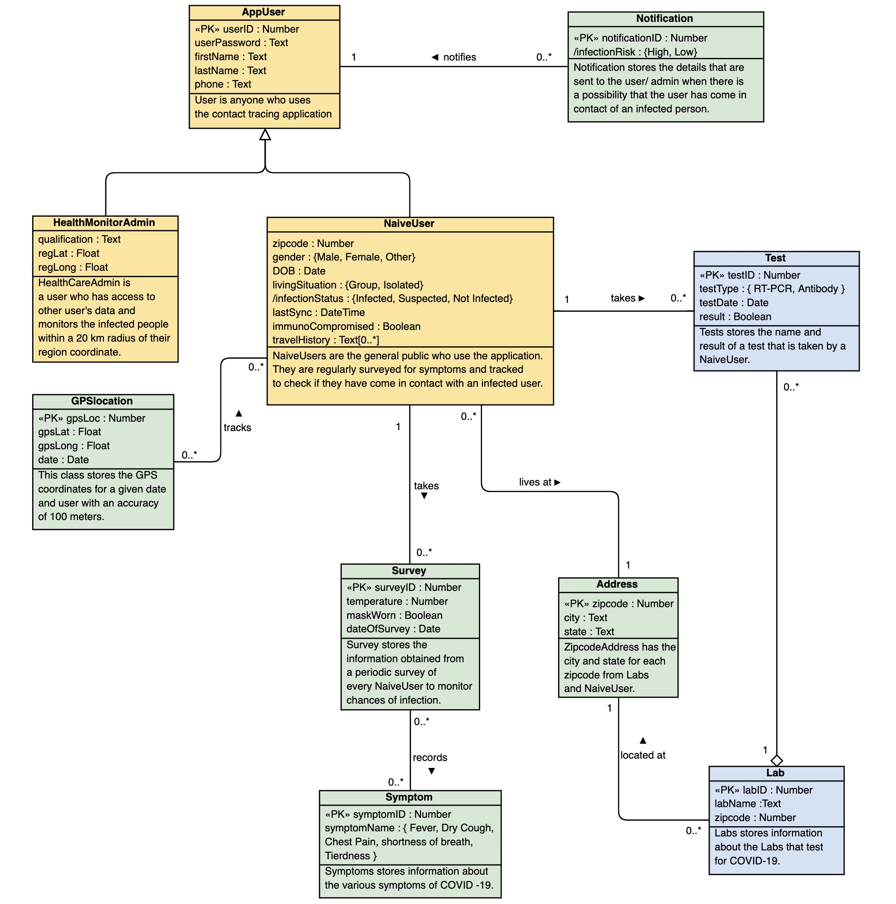

<center> 
**Varshitha Uppula**
<br>
**Saisrihitha Yadlapalli**
<br>
**(Group 3)**
</center>
<br>
<br>

## 1.Introduction

Contact Tracing, a core disease control measure employed by local and state health department personnel for decades, is a key strategy for preventing further spread of COVID-19. A relational database has been implemented to store information about a mobile application user who is tracked based on GPS which would aid to find the users who have come in contact with the infected patients. Surveys are conducted for users who can record their data about temperature, symptoms, etc. Additionally, information about labs and tests conducted in particular cities is maintained. 


## 2.Assumptions

The following are the key assumptions that we made with respect to developing the contact tracing database/models:


	
**1.** We have modeled our application such that it can be used for contact tracing for the Covid-19 pandemic, but with minor modifications it can be used for generic contact tracing and for analytical use cases as well.

**2.** An app user is anyone who can use the contact tracing application and can be divided into two categories: a **naïve user** and a **health monitor admin**. An app user can have only a **single phone number**.

**3.** A naïve user is one who can use the application and is regularly surveyed for symptoms and tracked to check if they have come in contact with an infected user. A naïve user is either **infected, not-infected** or **suspected** based on the **infection status** which is given to him/her based on the results of tests conducted by a particular lab that are verified by the health monitor admin.

**4.** A health monitor admin can view information regarding naïve users and will be notified if a naïve user in a region that the admin is responsible for monitoring has a high risk of having contracted Covid-19.

**5.** A naïve user will also be notified if he/she is at **risk** of contracting Covid-19. The risk (can be calculated using triggers) of a naïve user having contracted Covid-19 depends upon various factors such as: 

  + user symptoms and other information that get recorded as a part of regular surveys

  + medical condition of the user that compromises their immunity

  + travel history of user within a given time period

  + user coming in contact with zero or more infected user based on GPS tracking.


	
**6.** A naïve user is tracked based on GPS coordinates and we have considered “gpsLoc” as an attribute that uniquely identifies the coordinates the user on a particular date as we have considered the virus to be active/present where the infected person has been to for at least one day.


## 3.Conceptual model

Conceptual model showing the various entities at a high level is built using **Visual Paradigm**. 



<br>
<br>

## 4.Logical Model

Logical diagram with Crow's Foot Notation was built using **Lucid Chart**.

[Link to Logical Model](https://app.lucidchart.com/invitations/accept/55d3e1a0-dc6e-4a04-8d6c-6d30657dec3e)


<br>

## 5.Relational Schema Definitions

The logical schema shown above is resolved into the below relational schema. A relation R with attributes A1,A2,A3..An is shown as R(<u>A1</u>,A2,*A3*..An), where the primary key is <u>underlined</u> and foreign keys are shown in *italics*.
<br>
<br>
AppUser (<u>userID</u>, userPassword, firstName, lastName, phone)
<br>
<br>
HealthMonitorAdmin (<u>*adminID*</u>, regLat, regLong, qualification)
<br>
<br>
NaiveUser (<u>*naiveUserID*</u>, gender, immunoCompromised, DOB, lastSync, livingSituation, infectionStatus, *zipcode*)
<br>
<br>
Tracker (<u>trackerID</u>, *gpsLoc*, *naiveUserID*)
<br>
<br>
GPSlocation ( <u>gpsLoc</u>, gpsLat, gpsLong, date)
<br>
<br>
TravelHistory (<u>country</u>, <u>*naiveUserID*</u>)
<br>
<br>
Survey (<u>surveyID</u>, temperature, maskWorn, dateOfSurvey, *naiveUserID*)
<br>
<br>
Symptom (<u>symptomID</u>, symptomName)
<br>
<br>
SurveySymptom (<u>*symptomID*</u>, <u>*surveyID*</u>)
<br>
<br>
Test (<u>testID</u>, testType, testDate, result, *naiveUserID*, *labID*)
<br>
<br>
Lab (<u>labID</u>, labName, *zipcode*)
<br>
<br>
Address (<u>zipcode</u>, city, state)
<br>
<br>
Notification (<u>notificationID</u>, infectionRisk, *userID*)


## 6.Proof using functional dependencies to show that schema is in BCNF:

A relational schema is considered to be in BCNF if for every one of its dependencies X → Y one of the following conditions holds true:
<br>
  *X → Y is a trivial functional dependency (i.e Y is a subset of X) <br>
  *X is a superkey for the schema 
  <br>
<br>
**AppUser** 
<br>
userID → { userPassword, firstName, lastName, phone } 
<br>
phone → { userID, userPassword, firstName, lastName } 
<br>
(Here, there are two candidate keys userID and phone which uniquely identify the non-key attributes and hence satisfies BCNF) <br>
<br>
**HealthMonitorAdmin** 
<br>
adminID → { regLat, regLong, qualification }
<br>
<br>
**NaiveUser** 
<br>
naiveUserID → { gender, immunoCompromised, DOB, lastSync, livingSituation, infectionStatus, zipcode } <br>
<br>
**GPSlocation** <br>
gpsLoc → { gpsLat, gpsLong, date } <br>
<br>
**Tracker** <br>
trackerID → { gpsLoc, naiveUserID } <br>
<br>
**TravelHistory** <br>
country, naiveUserID form a composite primary key (trivial FD hence in BCNF) <br>
<br>
**Survey** <br>
surveyID → { temperature, maskWorn, dateOfSurvey, naiveUserID } <br>
<br>
**Symptom** <br>
symptomID → symptomName <br>
<br>
**SurveySymptom** <br>
surveyID, symptomID form a composite primary key (trivial FD hence in BCNF) <br>
<br>
**Test** <br>
testID → { testType, testDate, result, naiveUserID, labID } <br>
<br>
**Lab** <br>
labID → { labName, zipcode } <br>
<br>
**Address** <br>
Zipcode → { city, state } <br>
<br>
**Notification** <br>
notificationID → { infectionRisk, userID } <br>
<br>

## 7.Schema creation and Table definition in MySQL

Tables created in MySQL database using CREATE statements


<br>
**CREATE Statements**
<br>

CREATE DATABASE contactTracer; <br>
USE contactTracer; <br>

 

 <br>

CREATE TABLE appUser( <br>
userID INT PRIMARY KEY, <br>
userPassword VARCHAR(30) NOT NULL, <br>
firstName CHAR(30) NOT NULL, <br>
lastName CHAR(30), <br>
phone VARCHAR(13) NOT NULL UNIQUE <br>
); <br>

 <br>

CREATE TABLE address( <br>
zipcode INT PRIMARY KEY, <br>
city CHAR(20) NOT NULL, <br>
state CHAR(20) NOT NULL <br>
); <br>

 <br>

CREATE TABLE healthMonitorAdmin( <br>
adminID INT PRIMARY KEY, <br>
regLat DECIMAL(10,8) signed NOT NULL, <br>
regLong DECIMAL(11,8) signed NOT NULL, <br>
qualification VARCHAR(30), <br>
CONSTRAINT hm_admin FOREIGN KEY(adminID) REFERENCES appUser(userID) <br>
); <br>

<br> 

CREATE TABLE naiveUser( <br>
naiveUserID INT PRIMARY KEY, <br>
gender ENUM('Male', 'Female', 'Other'), <br>
dob DATE NOT NULL, <br>
immunoCompromised BOOLEAN NOT NULL, <br>
lastSync DATETIME, <br>
livingSituation ENUM('Group','isolated'), <br>
infectionStatus ENUM('infected','suspected','not-infected') NOT NULL, <br>
zipcode INT NOT NULL, <br>
CONSTRAINT naivU FOREIGN KEY(naiveUserID) REFERENCES appUser(userID), <br>
CONSTRAINT zip FOREIGN KEY(zipcode) REFERENCES address(zipcode) <br>
); <br>

 <br>

CREATE TABLE GPSlocation( <br>
gpsLoc INT PRIMARY KEY, <br>
gpsLat DECIMAL(10,8) signed NOT NULL, <br>
gpsLong DECIMAL(11,8) signed NOT NULL, <br>
date DATE NOT NULL <br>
); <br>

<br> 

CREATE TABLE tracker( <br>
trackerID INT PRIMARY KEY, <br>
gpsLoc INT NOT NULL, <br>
naiveUserID INT NOT NULL, <br>
CONSTRAINT gps_track FOREIGN KEY(gpsLoc) REFERENCES GPSlocation(gpsLoc),<br>
CONSTRAINT track_naive FOREIGN KEY(naiveUserID) REFERENCES naiveUser(naiveUserID) <br>
); <br>

 

<br>
CREATE TABLE travelHistory( <br>
country VARCHAR(20), <br>
naiveUserID INT, <br>
CONSTRAINT cn_naive PRIMARY KEY (country, naiveUserID), <br>
CONSTRAINT travel_naive FOREIGN KEY(naiveUserID) REFERENCES naiveUser(naiveUserID) <br>
); <br>

 

 <br>

CREATE TABLE survey( <br>
surveyID INT PRIMARY KEY, <br>
temperature INT, <br>
maskWorn BOOLEAN NOT NULL, <br>
dateOfSurvey DATE NOT NULL, <br>
naiveUserID INT NOT NULL, <br>
CONSTRAINT survey_user FOREIGN KEY(naiveUserID) REFERENCES naiveUser(naiveUserID) <br>
);<br>

 <br>

CREATE TABLE lab( <br>
labID INT PRIMARY KEY, <br>
labName VARCHAR(30), <br>
zipcode INT NOT NULL, <br>
CONSTRAINT zip_lab FOREIGN KEY(zipcode) REFERENCES address(zipcode)<br>
);<br>

 <br>

CREATE TABLE test( <br>
testID INT PRIMARY KEY, <br>
testType ENUM('Antibody','RT-PCR'), <br>
testDate DATE NOT NULL,<br>
result BOOLEAN NOT NULL,<br>
naiveUserID INT NOT NULL,<br>
labID INT NOT NULL,<br>
CONSTRAINT test_lab FOREIGN KEY(labID) REFERENCES lab(labID),<br>
CONSTRAINT test_user FOREIGN KEY(naiveUserID) REFERENCES naiveUser(naiveUserID) <br>
);<br>

 <br>

CREATE TABLE symptom(<br>
symptomID INT PRIMARY KEY,<br>
symptomName ENUM('Fever', 'Dry Cough', 'Chest Pain', 'Shortness of Breath', 'tiredness') <br>
);<br>

 <br>

CREATE TABLE surveySymptom (<br>
symptomID INT,<br>
surveyID INT,<br>
CONSTRAINT sy_sr PRIMARY KEY(symptomID,surveyID),<br>
CONSTRAINT sym_sur FOREIGN KEY(symptomID) REFERENCES symptom(symptomID),<br>
CONSTRAINT sur_sym FOREIGN KEY(surveyID) REFERENCES survey(surveyID)<br>
);<br>

 <br>

CREATE TABLE notification(<br>
notificationID INT PRIMARY KEY,<br>
infectionRisk ENUM('High','loW'),<br>
userID INT NOT NULL,<br>
CONSTRAINT notif_user FOREIGN KEY(NotificationID) REFERENCES appUser(userID)<br>
);


## 8.Constraint Checks

Check to ensure that none of the constraints are violated.


<br>

## 9.Inserting Data into database

Relevant dummy data inserted into the database using www.generatedata.com


<br>


<br>

## 10.Load Data into R

```{r echo =FALSE, warning = FALSE, message= FALSE}
if (!require("RMariaDB")) install.packages("RMariaDB")
library(RMariaDB)

contactTrace <- dbConnect(RMariaDB::MariaDB(), user='varshitha', password='PasswordChanged123', dbname='contactTracer', host='localhost')
dbListTables(contactTrace)
```
<br>

## 11. Execute Queries in R to show ContactTrace database

1.**(Join of 3 tables) Names of users from cities Grand Island, Harrisburg and Fayetteville who have a travel history to any country**


```{r INCLUDE= FALSE,warning = FALSE, message= FALSE}
query1<- "SELECT appUser.firstName , appUser.lastName, address.city, travelHistory.country 'Country travelled to'
FROM appUser,NaiveUser,travelHistory, address
WHERE appUser.userID = naiveUser.naiveUserID AND
naiveUser.naiveUserID= travelHistory.naiveUserID AND
address.zipcode=naiveUser.zipcode AND 
address.city IN ('Grand Island','Fayetteville','Harrisburg');"
```

```{r echo = FALSE,warning = FALSE, message= FALSE }
 
rs = dbSendQuery(contactTrace,query1)
result1<-dbFetch(rs)
result1

```

2.**(Subquery) Find non-infected users and their living situation who have come in contact with a infected person (*CONTACT TRACING*) based on GPS location and date **
```{r INCLUDE = FALSE,warning = FALSE, message= FALSE}
query2<-"SELECT distinct naiveUser.naiveUserID, naiveUser.livingSituation
FROM naiveUser, tracker, GPSlocation
WHERE naiveUser.naiveUserID = tracker.naiveUserID
AND tracker.gpsLoc = GPSlocation.gpsLoc
AND naiveUser.infectionStatus != 'infected'
AND tracker.gpsLoc IN ( SELECT tracker.gpsLoc FROM naiveUser, tracker
WHERE naiveUser.naiveUserID = tracker.naiveUserID
AND naiveUser.infectionStatus = 'infected');"
```

```{r echo = FALSE,warning = FALSE, message= FALSE}
rs = dbSendQuery(contactTrace,query2)
result2<-dbFetch(rs)
result2
```
3.**(Use having and Group By) List of all labs which have conducted more than 2 tests**


```{r INCLUDE = FALSE,warning = FALSE, message= FALSE}
query3<-"SELECT Count(test.testID) AS 'Test Count', lab.labName 'Lab Name'
FROM lab,test
WHERE test.labID = lab.labID
GROUP BY lab.labID
HAVING COUNT(test.testID)>1 ;"
```

```{r echo = FALSE,warning = FALSE, message= FALSE}
rs = dbSendQuery(contactTrace,query3)
result3<-dbFetch(rs)
result3
```
4.**(Complex query using SELECT CASE/WHEN)To determine risk status of a person **
```{r INCLUDE = FALSE,warning = FALSE, message= FALSE}
query4<-"SELECT naiveUserID, infectionStatus, immunoCompromised,
CASE WHEN infectionStatus = 'suspected' AND immunoCompromised = TRUE THEN 'This user is at high risk'
WHEN infectionStatus = 'suspected' AND immunoCompromised = FALSE THEN 'This user is at moderate risk'
WHEN infectionStatus = 'infected' THEN 'This user is Covid-19 positive'
WHEN infectionStatus = 'not-infected' AND immunoCompromised = TRUE THEN 'This user is at low risk'
ELSE 'This User is safe'
END AS Alert
FROM naiveUser;"
```

```{r echo = FALSE,warning = FALSE, message= FALSE}
rs = dbSendQuery(contactTrace,query4)
result4<-dbFetch(rs)
result4
```
```{r echo = FALSE,warning = FALSE, message= FALSE}
piechar <- table(result4$Alert)
lbels <- paste(names(piechar), "\n", piechar, sep="")
pie(piechar, labels = lbels,
   main="Pie-chart depicting user's risk of being infected by Covid-19")
```


5.**(Query of choice) GPS coordinates of infected users for Plotting- dummy data**

```{r INCLUDE = FALSE,warning = FALSE, message= FALSE}
query5<-"SELECT gpslocation.gpsLat AS Lattitude, gpslocation.gpsLong AS Longitude
FROM naiveUser, tracker, gpslocation
WHERE naiveUser.naiveUserID = tracker.naiveUserID AND
tracker.gpsLoc = gpslocation.gpsLoc
AND naiveUser.infectionStatus = 'infected';"
```

```{r echo = FALSE,warning = FALSE, message= FALSE}
rs = dbSendQuery(contactTrace,query5)
result5<-dbFetch(rs)
result5
```
```{r echo = FALSE, warning = FALSE, message= FALSE}
if (!require("gplots")) install.packages("gplots")
library(gplots)
x<- result5
y<- as.data.frame(x)
?heatmap.2
if (!require("leaflet")) install.packages("leaflet")
library(leaflet)
leaflet() %>%
  addTiles() %>%
 
   addMarkers(as.vector(y[1:100,"Lattitude"]),as.vector(y[1:100,"Longitude"]))
```

6.**(optional) Select of number of infected cases per city**

```{r INCLUDE = FALSE,warning = FALSE, message= FALSE}
query7<-"SELECT count(naiveUser.naiveUserID) AS 'infected case count', address.city
FROM naiveUser, address
WHERE naiveUser.zipcode= address.zipcode AND
naiveUser.infectionStatus = 'infected'
GROUP BY(address.city); 
"
```

```{r echo = FALSE,warning = FALSE, message= FALSE}

rs = dbSendQuery(contactTrace,query7)
result7<-dbFetch(rs)
result7
```


